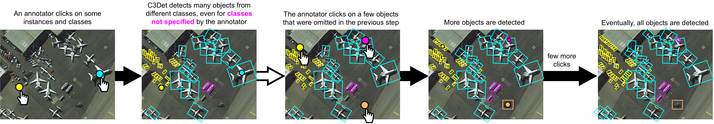

# Interactive Multi-Class Tiny-Object Detection
This repository contains the code for the training and evaluation of our CVPR 2022 paper.
We propose a novel interactive annotation method for multiple instances of tiny objects from multiple classes, based on a few point-based user inputs.
Our approach, C3Det, relates the full image context with annotator inputs in a local and global manner via late-fusion and feature-correlation, respectively.




- **Paper:** https://arxiv.org/abs/2203.15266
- **Video:** https://vimeo.com/720944419
- [Poster PDF](./c3det_poster.pdf)

**Note:** *This work was developed as part of work for [Lunit Inc.](https://www.lunit.io/en)*


## Introduction
This codebase is based on [AerialDetection](https://github.com/dingjiansw101/AerialDetection).
The master branch works with **PyTorch 1.1** or higher. If you would like to use PyTorch 0.4.1,
please checkout the [pytorch-0.4.1](https://github.com/open-mmlab/mmdetection/tree/pytorch-0.4.1) branch.

## Main Features

- **Tiny-DOTA dataset preparation**


- **A training data synthesis and an evaluation procedure**


- **Late fusion module (LF)**


- **Class-wise collated correlation module (C3)**


- **User-input enforcing loss (UEL)**


## Installation
### 1. Install and build the docker image
```
cd docker
bash build.sh ubuntu18.04-cuda9.2-cudnn7.6-python3.7-pt1.4.0
bash docker_run.sh
```

If you need to map a local folder to the docker environment, please use the `-v` option to request the mapping during `docker run`. (e.g., `-v /system/dir:/in/docker/dir`)

### 2. Enter the running docker container. The ID can be retrieved using `docker ps`
```
docker exec -it [DOCKER CONTAINER ID] bash
```

### 3. Install external libraries (e.g., mmdet and mmcv) with:
```
bash install.sh
```

## Data Preparation
### 1. Download the DOTA-v2.0 dataset
You can download DOTA-v2.0 dataset [here](https://captain-whu.github.io/DOTA/dataset.html).
You must first download DOTA-v1.0 images, and then download the extra images and annotations of DOTA-v2.0.

### 2. Split original DOTA-v2.0 dataset to make DOTA-Tiny dataset.
```
python DOTA_devkit/split_dataset_DOTA_Tiny.py --datapath ${original_datapath}
```
> ${original_datapath}: path of original DOTA-v2.0 dataset downloaded from [here](https://captain-whu.github.io/DOTA/dataset.html).

We will only use train and val dataset which have images and labels from original DOTA dataset.
On the other hand, test will not be used due to absence of labels, which are required for the training-time user-input synthesis as
well as the evaluation-time user-input sampling.

The script will map the original `train` and `val` folder to `train_old` and `val_old`.
It will make and divide the original dataset to new train, val, and test dataset (70\%, 10\%, and 20\% proportions).
The detailed information is here (5.1. Datasets section in https://arxiv.org/abs/2203.15266)

The dataset will be changed like this:
```
Original DOTA-v2.0 | Splitted DOTA-v2.0 | Tiny-DOTA
train              | train_old          | train (70%)
val                | val_old            | val (10%)
                   |                    | test (20%)
```
However, you must contain original test folder.

### 3. Split 1k x 1k size patches.
```
python DOTA_devkit/prepare_dota2.py --srcpath ${original_datapath} --dstpath ${patch_datapath}
```
> ${original_datapath}: path of splitted DOTA-Tiny

> ${patch_datapath}: path of splitted DOTA-Tiny as 1k x 1k size patches

### 4. Parse only tiny-objects from original DOTA classes.
```
python DOTA_devkit/parse_tiny_objects.py --datapath ${patch_datapath}
```
> ${patch_datapath}: path of splitted DOTA-Tiny as 1k x 1k size patches

This script will parse and generate tiny-objects (e.g., `ship`, `small-vehicle`, etc.) dataset from DOTA objects.
File names will be `DOTA2_{train1024, val1024, test1024}_tiny.json`.

## Configs for DOTA-Tiny
We wrote configuration files for Tiny-DOTA in `configs/DOTA2_Tiny` folder.

## Changed Files
```python
# Configuration
configs/DOTA2_Tiny

# C3 module
mmdet/models/C3/correlation.py

# Faster R-CNN HBB and OBB models
mmdet/models/detectors/faster_rcnn.py 
mmdet/models/detectors/faster_rcnn_obb.py 

# RetinaNet HBB and OBB models
mmdet/models/detectors/retina.py 
mmdet/models/detectors/retina_obb.py 

# UEL (User Enforcing Loss)
mmdet/models/rbbox_heads/convfc_rbbox_head.py (SharedFCBBoxHeadRbboxUserinput)
mmdet.models.losses.uel.py
```

## Pre-trained weights for the C3Det and baselines
You can obtain a copy of the pre-trained weights for C3Det and baseline methods [here](https://github.com/ChungYi347/Interactive-Multi-Class-Tiny-Object-Detection/releases/tag/checkpoints).
You have to make sure the configuration file such as `model_name` or `user_input_loss_enable`.

1. C3Det with UEL (`model_name`: `FasterRCNNOBBC3Det` and `user_input_loss_enable`: `True`)
```
bash tools/dist_test_noc.sh configs/DOTA2_Tiny/faster_rcnn_obb_r50_fpn_1x_dota2_tiny.py checkpoints/Tiny_DOTA_C3Det/Tiny_DOTA_C3Det.pth 1 --out checkpoints/Tiny_DOTA_C3Det/results.pkl --eval bbox
```

2. EarlyFusion (`model_name`: `FasterRCNNOBBEarlyFusion` and `user_input_loss_enable`: `False`)
```
bash tools/dist_test_noc.sh configs/DOTA2_Tiny/faster_rcnn_obb_r50_fpn_1x_dota2_tiny.py checkpoints/Tiny_DOTA_Early_Fusion/Tiny_DOTA_Early_Fusion.pth 1 --out checkpoints/Tiny_DOTA_Early_Fusion/results.pkl --eval bbox
```

3. LateFusion (`model_name`: `FasterRCNNOBBLateFusion` and `user_input_loss_enable`: `False`)
```
bash tools/dist_test_noc.sh configs/DOTA2_Tiny/faster_rcnn_obb_r50_fpn_1x_dota2_tiny.py checkpoints/Tiny_DOTA_Late_Fusion/Tiny_DOTA_Late_Fusion.pth 1 --out checkpoints/Tiny_DOTA_Late_Fusion/results.pkl --eval bbox
```

## Training
Before you try to train a model, you have to change the some line of configuration file such as model name, etc.
```
bash tools/dist_train.sh configs/DOTA2_Tiny faster_rcnn_obb_r50_fpn_1x_dota2_tiny.py [NUM_OF_GPUS]
(e.g., bash tools/dist_train.sh configs/DOTA2_Tiny/faster_rcnn_obb_r50_fpn_1x_dota2_tiny.py 8)
```

## Testing for NoC

```
bash tools/dist_test_noc.sh [CONFIGURATION_FILE_PATH] [CHECKPOINT_FILE_PATH] [NUM_OF_GPUS] --out [OUTPUT_PATH] -eval bbox
(e.g., bash tools/dist_test_noc.sh configs/DOTA2_Tiny/faster_rcnn_obb_r50_fpn_1x_dota2_tiny.py work_dirs/faster_rcnn_obb_r50_fpn_1x_dota2_tiny_FasterRCNNOBBC3Det_CrossEntropyLoss_0.01_0.0001/best.pth 8 --out work_dirs/faster_rcnn_obb_r50_fpn_1x_dota2_tiny_FasterRCNNOBBC3Det_CrossEntropyLoss_0.01_0.0001/results.pkl --eval bbox)
```
It will simulate user inputs up to 20 points for evaluating your model and drawing NoC curve.

## Testing for Normal

```
bash tools/dist_test.sh [CONFIGURATION_FILE_PATH] [CHECKPOINT_FILE_PATH] [NUM_OF_GPUS] --out [OUTPUT_PATH] -eval bbox
(e.g., bash tools/dist_test.sh configs/DOTA2_Tiny/faster_rcnn_obb_r50_fpn_1x_dota2_tiny.py work_dirs/faster_rcnn_obb_r50_fpn_1x_dota2_tiny_FasterRCNNOBBC3Det_CrossEntropyLoss_0.01_0.0001/best.pth 8 --out work_dirs/faster_rcnn_obb_r50_fpn_1x_dota2_tiny_FasterRCNNOBBC3Det_CrossEntropyLoss_0.01_0.0001/results.pkl --eval bbox)
```

It will simulate user inputs random number of user input from 0 to 20 and evaluate only once.

## Results
See [RESULTS.md](results/RESULTS.md).

## Citing

```
@InProceedings{lee2022interactive,
  title={Interactive Multi-Class Tiny-Object Detection},
  author={Lee, Chunggi and Park, Seonwook and Song, Heon and Ryu, Jeongun and Kim, Sanghoon and Kim, Haejoon and Pereira, S{\'e}rgio and Yoo, Donggeun},
  booktitle={The IEEE Conference on Computer Vision and Pattern Recognition (CVPR)},
  month = {June},
  year={2022}
}
```

## License

This project is released under the [Apache 2.0 license](LICENSE).

## Thanks to the Third Party Libs

[Pytorch](https://pytorch.org/)

[mmdetection](https://github.com/open-mmlab/mmdetection)
