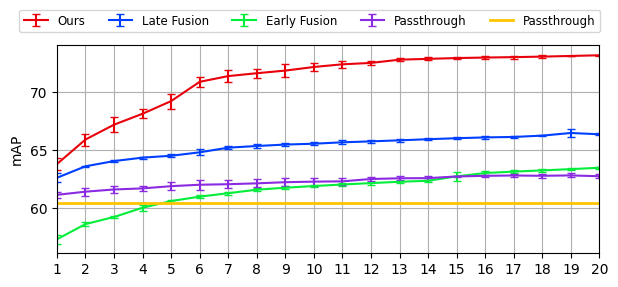
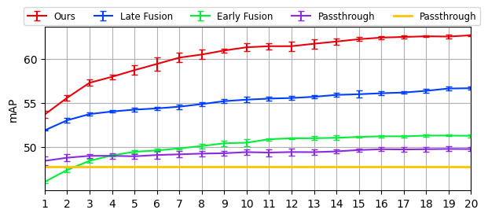

# Results
We provide Faster R-CNN and RetinaNet results on Tiny-DOTA datasets, and a script for drawing number of clicks (NoC) graph.

## Draw NoC Curve
```
python draw_noc_graph.py
```
Note that you can obtain new models' NoC curve.
1. Add new model results as XXX.json files in the Tiny-DOTA-FasterRCNN or Tiny-DOTA-RetinaNet folder.
2. Change code in the <code>draw_noc_graph.py</code> as follow: 
<br />
<code>
files = ['Ours.json', 'Late_Fusion.json', 'Early_Fusion.json', 'Passthrough.json', 'Faster_R-CNN.json']
</code>

## Faster R-CNN


Each json file represents our model and baseline results which included in average of mAP and standard deviation calculated by five times inference results.

## RetinaNet


Each json file represents our model and baseline results which included in average of mAP and standard deviation calculated by five times inference results.